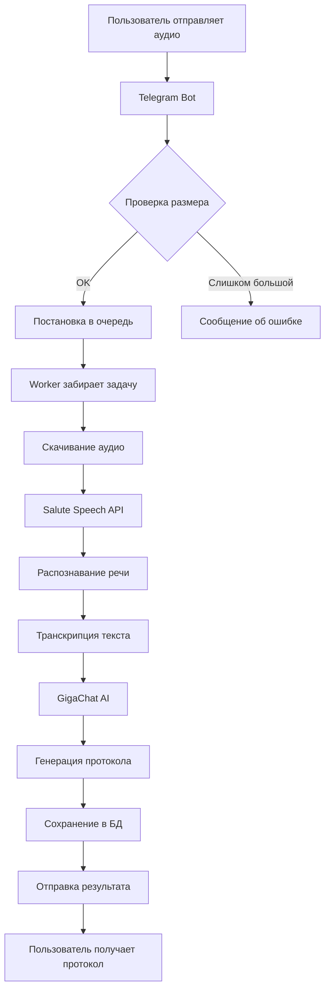

```markdown
# 🤖 Telegram Бот для обработки аудио и голосовых сообщений

## Обзор сервиса

Сервис представляет собой Telegram-бота для автоматической обработки аудиофайлов и голосовых сообщений с использованием технологий распознавания речи (Speech-to-Text) и искусственного интеллекта. Бот преобразует речь в текст, создает структурированные протоколы встреч и предоставляет возможность поиска по обработанным материалам.

---

## 🎯 Ключевые возможности

### 1. Распознавание речи
- **Поддержка различных форматов**: MP3, M4A, WAV, OGG, FLAC, Opus
- **Автоматическое определение формата** аудиофайла
- **Высокая точность распознавания** русского языка
- **Обработка голосовых сообщений** из Telegram

### 2. Интеллектуальная обработка
- **Автоматическое создание протоколов** встреч
- **Структурирование информации**:
  - Дата и время встречи
  - Участники обсуждения
  - Ключевые темы
  - Принятые решения
  - Ответственные лица и сроки
  - Следующие шаги

### 3. Управление встречами
- **Список всех встреч** пользователя
- **Просмотр детальной информации** по каждой встрече
- **Поиск по ключевым словам** с ранжированием результатов
- **Полнотекстовый поиск** по транскрипциям

### 4. Чат-ассистент
- **Интерактивное общение** с ИИ-ассистентом
- **Помощь в подготовке протоколов**
- **Контекстные ответы** на вопросы пользователя

---

## 🏗 Архитектура

### Технологический стек

| Компонент | Технология | Назначение |
|-----------|------------|------------|
| **Язык** | Go 1.21+ | Высокая производительность, конкурентность |
| **Telegram API** | telebot.v3 | Взаимодействие с Telegram Bot API |
| **Распознавание речи** | Salute Speech | Асинхронное распознавание аудио |
| **AI/LLM** | GigaChat | Генерация протоколов, чат-ассистент |
| **База данных** | PostgreSQL 15+ | Хранение пользователей и встреч |
| **Логирование** | slog | Структурированное логирование |

### Структура проекта

```
go-letopis/
├── cmd/bot/           # Точка входа приложения
├── internal/
│   ├── bot/           # Telegram бот (обработчики, middleware)
│   ├── domain/        # Доменные модели и интерфейсы
│   │   ├── entity/    # Сущности (User, Meeting)
│   │   └── repository/# Интерфейсы репозиториев
│   ├── infra/         # Инфраструктурный слой
│   │   ├── config/    # Конфигурация приложения
│   │   └── postgres/  # Подключение к БД
│   ├── services/      # Внешние сервисы
│   │   ├── gigachat/  # Интеграция с GigaChat
│   │   └── salutespeech/# Интеграция с Salute Speech
│   ├── usecase/       # Бизнес-логика
│   └── initapp/       # Инициализация приложения
├── configs/           # Конфигурационные файлы
└── docs/              # Документация
```

---

## 🔄 Схема работы



---

## 🚀 Основные функции бота

### Команды

| Команда | Описание | Пример |
|---------|----------|--------|
| `/start` | Начало работы, регистрация пользователя | `/start` |
| `/help` | Показать справку по командам | `/help` |
| `/list` | Список всех встреч | `/list` |
| `/get <id>` | Просмотр деталей встречи | `/get 123` |
| `/find <keywords>` | Поиск по ключевым словам | `/find бюджет сайт` |
| `/chat <текст>` | Общение с ИИ-ассистентом | `/chat как подготовить протокол?` |

### Обработка аудио

- **Аудиофайлы** (любые вложения)
- **Голосовые сообщения** (voice messages)
- **Ограничение**: до 20 MB
- **Автоматическое определение** формата и расширения

---

## 💡 Преимущества

### Для пользователей
1. **Экономия времени** — автоматическая расшифровка встреч
2. **Структурированные протоколы** — ключевые решения, ответственные, сроки
3. **Поиск по архиву** — быстрый доступ к любой встрече
4. **Голосовой ввод** — просто отправьте голосовое сообщение
5. **Удобный интерфейс** — привычный Telegram

### Технические преимущества
1. **Асинхронная обработка** — не блокирует пользователя
2. **Очередь задач** — выдерживает высокие нагрузки
3. **Graceful shutdown** — корректное завершение работы
4. **Структурированное логирование** — легкая отладка
5. **Модульная архитектура** — простота расширения
6. **Поддержка конфигурации** — YAML + переменные окружения

---

## 📊 Ключевые метрики

| Параметр | Значение |
|----------|----------|
| Максимальный размер файла | 20 MB |
| Таймаут обработки | 10 минут |
| Размер очереди задач | 2 × кол-во воркеров |
| Количество воркеров | 5 (настраивается) |
| Интервал очистки | 1 час |
| Время жизни временных файлов | 24 часа |

---

## 🔒 Безопасность и конфиденциальность

- **Не храним аудиофайлы** после обработки
- **Автоматическая очистка** временных файлов
- **Данные пользователей** только в рамках сессии
- **SSL/TLS** для всех внешних подключений
- **Токены и секреты** через конфигурацию/переменные окружения

---

## 📈 Планы развития

### Ближайшие планы
- [ ] Поддержка видеосообщений
- [ ] Экспорт протоколов в PDF
- [ ] Мультиязычность (английский, казахский)
- [ ] Интеграция с календарями (Google, Outlook)

### Долгосрочные планы
- [ ] Веб-интерфейс для управления встречами
- [ ] API для сторонних интеграций
- [ ] Поддержка Zoom/Teams интеграции
- [ ] Аналитика по встречам

---

## 🛠 Установка и запуск

### Требования
- Go 1.21+
- PostgreSQL 15+
- Учетные записи Salute Speech и GigaChat

### Быстрый старт

```bash
# Клонирование репозитория
git clone https://github.com/skiphead/go-letopis.git
cd go-letopis

# Настройка конфигурации
cp configs/config.example.yaml configs/config.yaml
# Отредактируйте config.yaml с вашими данными

# Создание базы данных
psql -U postgres -c "CREATE DATABASE letopis"

# Запуск миграций (если есть)
# go run cmd/migrate/main.go

# Запуск бота
go run cmd/bot/main.go -config=configs/config.yaml
```

---

## 📞 Контакты и поддержка

- **Разработчик**: [@skiphead](https://github.com/skiphead)
- **Проект на GitHub**: [go-letopis](https://github.com/skiphead/go-letopis)

---

## 📄 Лицензия

MIT License. Подробности в файле [LICENSE](LICENSE)

---

## 🎉 Заключение

Сервис предоставляет современное решение для автоматизации документирования встреч и совещаний. Используя передовые технологии распознавания речи и искусственного интеллекта, бот позволяет сосредоточиться на содержании встречи, а не на ведении записей.

**Главные преимущества:**
- ⚡ **Скорость** — обработка в фоновом режиме
- 🎯 **Точность** — высококачественное распознавание
- 🔍 **Поиск** — быстрый доступ к архиву
- 🤖 **AI-помощник** — интеллектуальная обработка
- 🏗 **Масштабируемость** — готов к высоким нагрузкам

**Попробуйте уже сегодня!** 🚀
```